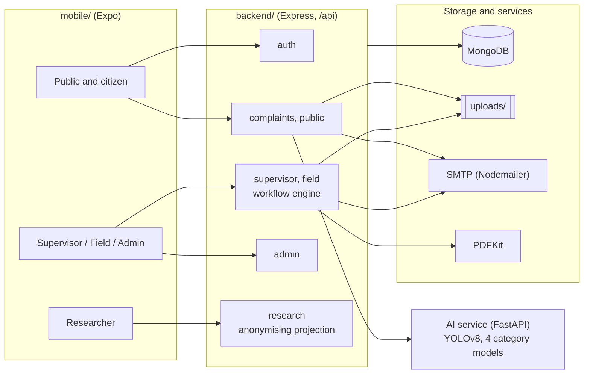
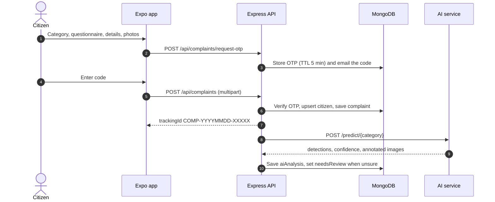

<div align="center">


<br>

<p>
  
  
  
  
  
  
  
</p>

</div>

# UrbanFix

UrbanFix is an AI-powered governance system for civic infrastructure complaints. Citizens report potholes, litter, open manholes and graffiti from a mobile app without creating an account. A YOLOv8 model trained for the selected category checks each photo, a weighted questionnaire sets the urgency, and a ward-based staff workflow takes the complaint from triage to field repair, photo proof and a closing PDF receipt. Every complaint and its status history is published in a public registry, and approved researchers can export anonymised data.

## Contents

- [Components](#components)
- [Architecture](#architecture)
- [Getting started](#getting-started)
- [Configuration](#configuration)
- [AI models](#ai-models)
- [Complaint workflow](#complaint-workflow)
- [API reference](#api-reference)
- [Security and privacy](#security-and-privacy)
- [Repository layout](#repository-layout)
- [Documentation](#documentation)

## Components

| Directory | Stack | Responsibility |
|:--|:--|:--|
| [`mobile/`](./mobile) | Expo SDK 57, React Native 0.86, React 19, React Navigation 7, Reanimated 4, FlashList, react-native-svg | The only client. Role-based tab sets for citizens, supervisors, field workers, admins and researchers. Runs in Expo Go on Android and iOS, and in the browser for development. |
| [`backend/`](./backend) | Node.js 20, Express 4, Mongoose 8, JWT, bcrypt, Zod, Multer, Nodemailer, PDFKit | REST API: auth and invites, complaint intake with email OTP, workflow engine, attendance and leave, PDF receipts, public registry, research access with audit logging. |
| [`ai_model/`](./ai_model) | Python 3, PyTorch 2.14, Ultralytics 8.4 | Dataset preparation, training and evaluation notebooks for the four category models, trained weights and evaluation results. |
| [`docs/`](./docs) | Markdown, Word | System description, project report, report figures and README graphics. |

### Roles

| Role | Access | Main capabilities |
|:--|:--|:--|
| Citizen | No account; email OTP per complaint | File, track, download receipt, browse registry |
| Supervisor | Admin invite | Triage, assign within ward, review proof, close or send for rework, approve field leave |
| Field worker | Admin invite | Start assigned tasks, upload proof photos, check in and out, request leave |
| Admin | Admin invite or seed script | Analytics, status override, staff accounts, supervisor leave, research approvals, research audit log |
| Researcher | Public application, admin approval | Grouped queries and CSV or JSON export of anonymised data until access expires |

## Architecture



Complaint submission, end to end:



The AI call runs after the tracking ID is returned, so model latency or failure never blocks a submission.

## Getting started

### Prerequisites

| Tool | Version | Used by |
|:--|:--|:--|
| Node.js and npm | 20 or newer | `backend/`, `mobile/` |
| MongoDB | 7 or newer, running locally | `backend/` |
| Expo Go | Build with SDK 57 support | Testing on a phone (same Wi-Fi as the dev machine) |
| Python | 3.11 or newer | `ai_model/` |

### Backend

```bash
cd backend
cp .env.example .env          # set JWT_SECRET; SMTP settings are optional in development
npm install
npm run seed:roles            # one development account per role
npm run seed:complaints       # optional: sample complaints over the last 12 months
npm run dev                   # http://localhost:5001, health check at GET /health
```

Without SMTP settings the backend creates an Ethereal test inbox and logs its credentials, so OTP and status emails can be read during development.

### Mobile app

```bash
cd mobile
npm install
npx expo start --go -c
```

Scan the QR code with Expo Go, press `w` for the browser or `a` for an Android emulator. The app calls the backend on port 5001 of the host that serves Metro, so no API URL is needed locally. See [`mobile/README.md`](./mobile/README.md) for device and browser differences.

### AI models

```bash
cd ai_model
python3 -m venv .venv && source .venv/bin/activate
pip install -r requirements.txt
jupyter lab notebooks/
```

Run `00_download_datasets.ipynb` once, then `01` to `04` to train a category model. Each training notebook copies its best checkpoint into `ai_model/weights/`. The trained weights for all four models are already in that folder.

### Development accounts

Created by `npm run seed:roles` (idempotent; refuses to run when `NODE_ENV=production`).

| Role | Email | Password |
|:--|:--|:--|
| Admin | `admin@example.com` | `Passw0rd!123` |
| Supervisor (Ward 1) | `supervisor@example.com` | `Passw0rd!123` |
| Field worker (Ward 1) | `field1@example.com` | `Passw0rd!123` |
| Field worker (Ward 2) | `field2@example.com` | `Passw0rd!123` |
| Researcher, aggregate only | `researcher@example.com` | `Passw0rd!123` |
| Researcher, anonymised records | `researcher-records@example.com` | `Passw0rd!123` |

`npm run seed:admin` also creates `admin@complaintsystem.gov` / `admin_password_123`.

### Backend scripts

| Command | Purpose |
|:--|:--|
| `npm run dev` | Start the API with nodemon |
| `npm start` | Start the API |
| `npm run seed:admin` | Create the original admin account |
| `npm run seed:roles` | Create one account per role |
| `npm run seed:complaints` | Insert sample complaints (`--count`, `--days`, `--fresh`) |
| `npm run backfill:stage-ward` | Fill `stage` and `ward` on legacy complaints |
| `npm run backfill:public` | Mark legacy complaints public |
| `npm run backfill:urgency` | Normalise legacy urgency values |

## Configuration

`backend/.env`

| Variable | Required | Description |
|:--|:--|:--|
| `PORT` | no | API port. The app expects `5001`. |
| `MONGO_URI` | no | Defaults to `mongodb://localhost:27017/complaint_system` |
| `JWT_SECRET` | yes | Signs session tokens and keys the HMAC for anonymised research record IDs |
| `JWT_EXPIRES_IN` | no | Token lifetime, default `7d` |
| `EMAIL_HOST`, `EMAIL_PORT`, `EMAIL_USER`, `EMAIL_PASS`, `EMAIL_FROM` | no | SMTP transport. Ethereal is used when unset. |
| `APP_LINK_BASE` | no | Deep-link base for invite emails, default `dsn://` |
| `DISABLE_JOBS` | no | `true` disables the researcher expiry email job |

`mobile/.env`

| Variable | Required | Description |
|:--|:--|:--|
| `EXPO_PUBLIC_API_URL` | no | Overrides the API base URL, for a deployed backend or `expo start --tunnel` |

## AI models

Each complaint category has its own YOLOv8 nano model, fine-tuned from COCO weights. A category is offered in the app only if a public, documented dataset with localised labels (boxes or masks) of street-level images exists for it; the category list is enforced by `backend/constants/categories.js` and mirrored in `mobile/src/constants/categories.js`.

### Models

| Category | Weights | Base model | Task | Output |
|:--|:--|:--|:--|:--|
| Pothole / Road Damage | `ai_model/weights/pothole_road_damage_model.pt` | `yolov8n-seg` | Instance segmentation | Boxes, masks, damaged-area share |
| Garbage / Litter | `ai_model/weights/garbage_litter_model.pt` | `yolov8n-seg` | Instance segmentation | Boxes, masks |
| Open Manhole | `ai_model/weights/open_manhole_model.pt` | `yolov8n` | Object detection | Boxes |
| Graffiti | `ai_model/weights/graffiti_model.pt` | `yolov8n` | Object detection | Boxes |

### Datasets

| Category | Dataset | Labels | Images used | Train / val | Licence |
|:--|:--|:--|:--|:--|:--|
| Pothole / Road Damage | [Roboflow Pothole Segmentation YOLOv8 v1](./ai_model/Pothole_Segmentation_YOLOv8.v1i.yolov8) | Polygon masks, 1 class | 780 | 720 / 60 | CC BY 4.0 |
| Garbage / Litter | [TACO](http://tacodataset.org) (Proença and Simões, 2020) | COCO masks, 60 classes merged to `Litter` | 1,428 of 1,500 (rest no longer downloadable) | 1,214 / 214 (85:15, seed 0) | See TACO repository |
| Open Manhole | [Road Hazards Dataset](https://www.kaggle.com/datasets/sabidrahman/pothole-cracks-and-openmanhole) | YOLO boxes, manhole class kept | 1,603 | 1,123 / 480 | See Kaggle page |
| Graffiti | [STORM graffiti/tagging dataset](https://zenodo.org/records/3238357) (University of West Attica) | Bounding boxes, 1 class | 1,022 | 813 / 209 | CC BY 4.0 |

The open manhole training split holds all 673 images containing a manhole plus 450 random negatives; validation is the dataset's full validation split (148 of 480 images contain a manhole).

### Training configuration

| Setting | Value |
|:--|:--|
| Image size, batch | 640 x 640, 16 |
| Epochs | 60 pothole, 45 litter, 45 manhole, 50 graffiti; early stopping with patience 15 |
| Optimiser, augmentation | Ultralytics defaults (`optimizer=auto`, mosaic, HSV, flips, scale, translate) |
| Hardware | Apple M5, 16 GB, PyTorch 2.14 MPS backend, seed 0 |

### Results

Validation metrics of the best checkpoint (`ai_model/results/eval.json`, produced by `05_evaluate_models.ipynb`).

| Model | Metric set | Precision | Recall | mAP50 | mAP50-95 |
|:--|:--|--:|--:|--:|--:|
| Pothole / Road Damage | box | 0.733 | 0.682 | 0.719 | 0.447 |
| Pothole / Road Damage | mask | 0.725 | 0.711 | **0.724** | 0.426 |
| Garbage / Litter | box | 0.748 | 0.446 | 0.521 | 0.375 |
| Garbage / Litter | mask | 0.757 | 0.434 | **0.502** | 0.317 |
| Open Manhole | box | 0.890 | 0.874 | **0.908** | 0.469 |
| Graffiti | box | 0.836 | 0.604 | **0.729** | 0.526 |

| Model | Epochs run | Best epoch | Training time | CPU latency | MPS latency |
|:--|--:|--:|--:|--:|--:|
| Pothole / Road Damage | 60 | 50 | 41 min | 33 ms | 11 ms |
| Garbage / Litter | 45 | 43 | 52 min | 24 ms | 20 ms |
| Open Manhole | 42 (early stop) | 39 | 34 min | 19 ms | 8 ms |
| Graffiti | 50 | 48 | 29 min | 20 ms | 6 ms |

Latency is the mean over 40 validation images at 640 px, batch size 1, after three warm-up runs, including pre- and post-processing.

Notes:

- The Road Hazards dataset ships augmented copies of some photos, so the open manhole score is likely optimistic.
- Litter recall is limited by the 60-to-1 class merge and the large share of small objects in TACO.
- A low-confidence or empty result marks the complaint `needsReview` for a supervisor. The model never rejects a complaint.

### Inference interface

The backend calls the AI service with the complaint photos after the complaint is saved and stores the response in `Complaint.aiAnalysis`.

| Endpoint | Description |
|:--|:--|
| `POST /predict/{category}` | Multipart photos. Returns `detected`, `confidence`, `detections` (`image`, `label`, `confidence`, `box`), `damagePercent` for segmentation models, and annotated images. |
| `GET /models` | Loaded model per category |
| `GET /health` | Health check |

```python
from ultralytics import YOLO

model = YOLO("ai_model/weights/pothole_road_damage_model.pt")
result = model.predict("photo.jpg", imgsz=640, conf=0.25)[0]
boxes = result.boxes.xyxy.tolist()
scores = result.boxes.conf.tolist()
```

### Notebooks

| Notebook | Purpose |
|:--|:--|
| `00_download_datasets.ipynb` | Download TACO, STORM and Road Hazards into `ai_model/data/raw/` |
| `01_pothole_road_damage.ipynb` | Train the pothole segmentation model |
| `02_garbage_litter.ipynb` | Convert TACO to single-class YOLO segmentation and train |
| `03_open_manhole.ipynb` | Extract the manhole class from Road Hazards and train |
| `04_graffiti.ipynb` | Convert STORM CSV boxes to YOLO and train |
| `05_evaluate_models.ipynb` | Metrics, PR curves, confusion counts, latency, training history |
| `06_report_figures.ipynb` | Model figures used in the project report |

More detail: [`ai_model/README.md`](./ai_model/README.md).

## Complaint workflow

Staff work with a detailed `stage`; the public sees a derived `status`. Transitions are defined in [`backend/utils/complaintStage.js`](./backend/utils/complaintStage.js) and enforced in [`backend/services/complaintWorkflow.js`](./backend/services/complaintWorkflow.js).


| Action | From | To | Allowed roles | Rule |
|:--|:--|:--|:--|:--|
| `accept` | `submitted` | `accepted` | supervisor, admin | remarks of 10+ characters |
| `reject` | `submitted` | `triage_rejected` | supervisor, admin | remarks of 10+ characters |
| `assign` | `accepted`, `assigned` | `assigned` | supervisor, admin | same ward (admin may override); assignee active and not on leave |
| `start` | `assigned` | `work_in_progress` | field | assignee only |
| `proof` | `work_in_progress` | `proof_submitted` | field | completion note, up to 3 photos |
| `close` | `proof_submitted` | `closed` | supervisor, admin | remarks; PDF receipt emailed to citizen |
| `rework` | `proof_submitted` | `assigned` | supervisor, admin | remarks of 10+ characters |

Status mapping: `submitted` is Pending, `triage_rejected` is Rejected, `closed` is Resolved, every other stage is In Progress. Each transition appends status, stage, actor, remarks and timestamp to `statusHistory`.

## API reference

All routes are prefixed with `/api`; uploaded files are served from `/uploads`. Protected routes expect `Authorization: Bearer <JWT>`.

| Prefix | Auth | Endpoints |
|:--|:--|:--|
| `/api/auth` | public, `GET /me` authenticated | `POST /register`, `/verify-otp`, `/resend-otp`, `/login`, `/set-password`; `GET /me` |
| `/api/complaints` | public, `/my-complaints` citizen | `POST /request-otp`, `POST /` (multipart, field `images`, max 3); `GET /track/:trackingId`, `/download-receipt/:trackingId`, `/my-complaints` |
| `/api/public` | public | `GET /complaints?category&status&ward&location&page&limit`, `GET /stats` |
| `/api/supervisor` | supervisor, admin | `GET /queue`, `/complaints/:id`, `/field-staff`, `/stats`, `/leave`; `PATCH /complaints/:id/{accept,reject,assign,close,rework}`, `/leave/:id` |
| `/api/field` | field | `GET /tasks`, `/tasks/:id`, `/stats`, `/leave`, `/attendance`; `PATCH /tasks/:id/start`; `POST /tasks/:id/proof`, `/leave`, `/attendance/check-in`, `/attendance/check-out` |
| `/api/admin` | admin | `GET /stats`, `/activity-heatmap`, `/complaints`, `/users`, `/research-applications`, `/audit/research`, `/leave`; `POST /users`; `PATCH /complaints/:id/status`, `/users/:id`, `/users/:id/{deactivate,reactivate}`, `/research-applications/:id`, `/leave/:id` |
| `/api/research` | `POST /apply` public, rest researcher or admin | `GET /me`, `/dashboard`, `/query`, `/export?format=csv\|json` |

Errors return `{ "status": "fail", "message": "..." }` for 4xx responses and `"status": "error"` for 5xx. Request bodies are validated with Zod.

## Security and privacy

| Area | Implementation |
|:--|:--|
| Citizen identity | No accounts; per-complaint email OTP (6 digits, TTL index, 5 min). Public responses omit `citizenId`, and the filer appears as "Citizen" in timelines. |
| Staff onboarding | Admin-created accounts receive a 72-hour invite link; only the SHA-256 hash of the token is stored. Login is blocked until the password is set. |
| Authentication | bcrypt (cost 12), JWT (default 7 days), role checks on every protected route, deactivated users rejected. |
| Audit trail | Staff are soft-deleted (`isActive: false`) so history references stay valid. |
| Research data | One projection strips identity, free text, street address, tracking ID and photos; location coarsened to ward, dates to day; record IDs are HMACs. Exports capped at 5 per day and 5,000 rows, CSV cells guarded against formula injection, every access logged, hard expiry with a 3-day email warning. |

## Repository layout

```
.
├── mobile/                      Expo app
│   └── src/
│       ├── navigation/          role-based tab sets, deep links (dsn://)
│       ├── screens/             public/ citizen/ supervisor/ field/ admin/ research/
│       ├── components/          shared UI, charts, tab bar
│       ├── services/            api.js (Axios + JWT), tokenStore.js
│       └── constants/ utils/ hooks/ contexts/ theme.js
├── backend/                     Express API
│   ├── server.js                entry point, mounts /api routes
│   ├── routes/ controllers/     auth, complaints, public, supervisor, field, admin, research
│   ├── models/                  User, Complaint, Otp, LeaveRequest, AttendanceRecord, Research*
│   ├── services/                workflow engine, email, PDF receipts, expiry job
│   ├── constants/ validators/ middleware/ utils/
│   └── scripts/                 seed and backfill scripts
├── ai_model/
│   ├── notebooks/               00 to 06: download, prepare, train, evaluate, figures
│   ├── weights/                 trained category models (.pt)
│   ├── results/                 eval.json and split metadata
│   ├── requirements.txt
│   └── Pothole_Segmentation_YOLOv8.v1i.yolov8/
└── docs/
    ├── project_description.md   full system description
    ├── project_report/          report.docx, report.pdf, figures/
    ├── assets/                  README graphics
    └── sample-images/           test photos
```

`ai_model/data/` and `ai_model/runs/` are created by the notebooks and are git-ignored.

## Documentation

| Document | Contents |
|:--|:--|
| [`docs/project_description.md`](./docs/project_description.md) | Modules, schemas, every endpoint, AI pipeline |
| [`docs/project_report/report.pdf`](./docs/project_report/report.pdf) | Project Exhibition I report |
| [`docs/project_report/figures/INDEX.md`](./docs/project_report/figures/INDEX.md) | Report figures with data sources |
| [`ai_model/README.md`](./ai_model/README.md) | Model training, results and dataset licences |
| [`mobile/README.md`](./mobile/README.md) | Running the app on devices and in the browser |

## Authors

Parth Pancholi, Aditya Dev, Prince Mahar, Arun Kumar and Aditi Sahu, School of Computing Science and Engineering, VIT Bhopal University. Project Exhibition I (DSN2098), supervised by Dr. Gaurav Soni.
