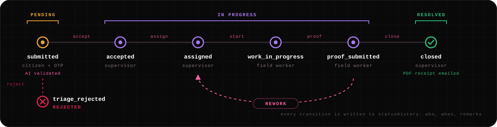
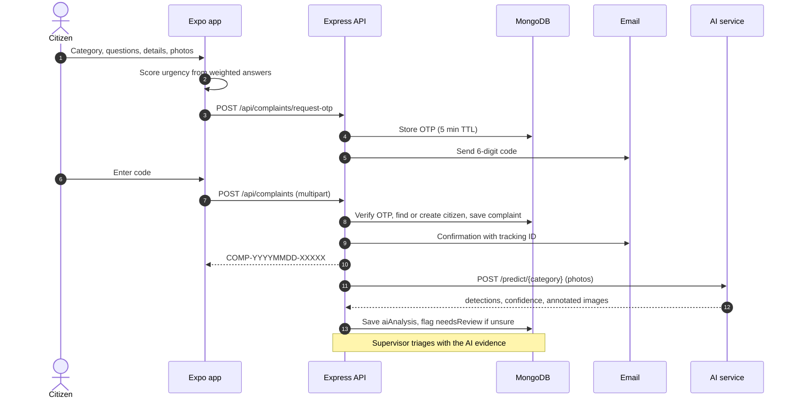
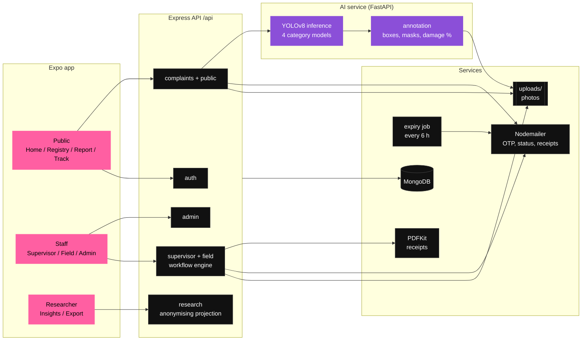

<div align="center">



<br>

<p>
  
  
  
  
  
  
  
  
</p>

<p>
  
  
  
  
  
  
</p>

<h3>
  <a href="#overview">Overview</a>
  <span> &middot; </span>
  <a href="#the-governance-loop">Loop</a>
  <span> &middot; </span>
  <a href="#roles">Roles</a>
  <span> &middot; </span>
  <a href="#complaint-lifecycle">Lifecycle</a>
  <span> &middot; </span>
  <a href="#architecture">Architecture</a>
  <span> &middot; </span>
  <a href="#quick-start">Quick start</a>
  <span> &middot; </span>
  <a href="#api">API</a>
  <span> &middot; </span>
  <a href="#ai-validation">AI</a>
</h3>

</div>

<br>

## Overview

**UrbanFix is an AI-powered, end-to-end governance system.** It takes a citizen's photo all the way to a verified, publicly audited repair, and turns the result into open data.

Citizens report problems from their phone **without creating an account** and verify each report with a one-time email code. A **computer vision model trained for that category** checks the photo and highlights the problem. Urgency comes from a weighted questionnaire and the AI's damage estimate. Ward supervisors triage with the AI evidence in front of them, field workers fix the issue and upload proof, and every closure produces a receipt. **Every complaint and every status change is public**, and approved researchers can analyse the anonymised data.

<table>
  <tr>
    <td align="center" width="25%">
      <h1>4</h1>
      <sub><b>AI-VALIDATED CATEGORIES</b></sub><br>
      <sub>one model each</sub>
    </td>
    <td align="center" width="25%">
      <h1>5</h1>
      <sub><b>ROLES</b></sub><br>
      <sub>citizen to researcher</sub>
    </td>
    <td align="center" width="25%">
      <h1>7</h1>
      <sub><b>WORKFLOW STAGES</b></sub><br>
      <sub>server-enforced</sub>
    </td>
    <td align="center" width="25%">
      <h1>0</h1>
      <sub><b>ACCOUNTS TO REPORT</b></sub><br>
      <sub>email OTP only</sub>
    </td>
  </tr>
</table>

<table>
  <tr>
    <th width="33%"><a href="./mobile"><code>mobile/</code></a></th>
    <th width="33%"><a href="./backend"><code>backend/</code></a></th>
    <th width="33%"><a href="./ai_model"><code>ai_model/</code></a></th>
  </tr>
  <tr>
    <td valign="top">Expo (React Native) app. The only client. Runs on Android and iOS through Expo Go, and in the browser for development.</td>
    <td valign="top">Express + MongoDB REST API. Auth, complaints, staff workflow, attendance and leave, email, PDF receipts, research exports.</td>
    <td valign="top">Per-category YOLOv8 training notebooks and datasets, served by a FastAPI inference service that validates every complaint photo.</td>
  </tr>
</table>

<br>

## The governance loop



| | Link | What happens | Where |
|:--:|:--|:--|:--|
| **01** | **Report** | Citizen files with photos and verifies by email OTP. No account. | `mobile/` Report tab |
| **02** | **Validate** | The category's YOLOv8 model finds the problem, boxes or masks it, and scores its confidence. | FastAPI AI service |
| **03** | **Prioritise** | Weighted questionnaire plus AI damage estimate give the urgency. | app + `aiAnalysis` |
| **04** | **Act** | Supervisor triages with AI evidence, assigns in ward. Field worker fixes and uploads proof. | staff workflow |
| **05** | **Prove** | Closure emails a PDF receipt. Full timeline is public. | registry, tracker |
| **06** | **Learn** | Researchers query and export anonymised data. Admins track performance. | research, analytics |

<br>

## Features

<table>
<tr>
<td valign="top" width="50%">

#### AI photo validation
Every photo goes through a YOLOv8 model trained for its category. Staff see the problem **boxed or masked** on an annotated image, with a confidence score. Low-confidence reports are flagged for review, never auto-rejected.

</td>
<td valign="top" width="50%">

#### Evidence-based urgency
A 6-step wizard asks severity-weighted yes/no questions and scores urgency **live**. The AI adds its own estimate, such as the damaged share of a road surface, as a second opinion.

</td>
</tr>
<tr>
<td valign="top">

#### No account, full tracking
A 6-digit email code verifies the report, and the tracking ID `COMP-YYYYMMDD-XXXXX` comes back at once. Anyone can follow the full timeline, and resolved complaints have a **PDF receipt**.

</td>
<td valign="top">

#### Public registry and live stats
Every complaint is listed, newest first, with filters for category, status, ward and location. Citizen identities are always redacted.

</td>
</tr>
<tr>
<td valign="top">

#### Ward-based field operations
Supervisors assign work only within their ward and never to someone on approved leave. Field workers upload proof photos before a job can close.

</td>
<td valign="top">

#### Privacy-safe open data
Approved researchers query and export anonymised data, with time-limited access, daily export limits and a full audit log.

</td>
</tr>
</table>

<br>

## Roles

Each role gets its own tab set in the app. The **server's** role decides which one, not the login screen.

| Role | Access | Can do | Tabs |
|:--|:--|:--|:--|
| **Citizen** | none needed | File, track, download receipts, browse registry. Optional account for "My complaints". | Home, Registry, Report, Track, Account |
| **Supervisor** | admin invite | Triage with AI results and annotated photos (accept or reject), assign in ward, review proof, close or send back for rework, approve field leave. | Queue, Field Staff, Track, Profile |
| **Field worker** | admin invite | Start assigned tasks, upload proof and a completion note, check in and out, request leave. | My Tasks, Completed, Profile |
| **Admin** | admin invite | Analytics, status overrides, staff accounts, supervisor leave, research approvals, research audit log. | Stats, Complaints, People |
| **Researcher** | public application, admin approval | Insights, grouped queries, CSV and JSON export, until access expires. | Insights, Registry, Track, Profile |

<br>

## Complaint lifecycle



Staff work with a detailed internal `stage`. Citizens and the registry see the simpler public `status` derived from it. The transition table lives in [`backend/utils/complaintStage.js`](./backend/utils/complaintStage.js) and is enforced in [`backend/services/complaintWorkflow.js`](./backend/services/complaintWorkflow.js).

<details>
<summary><b>Transition rules</b></summary>
<br>

| Action | From | To | Who |
|:--|:--|:--|:--|
| `accept` | `submitted` | `accepted` | supervisor, admin |
| `reject` | `submitted` | `triage_rejected` | supervisor, admin |
| `assign` | `accepted`, `assigned` | `assigned` | supervisor, admin |
| `start` | `assigned` | `work_in_progress` | assigned field worker |
| `proof` | `work_in_progress` | `proof_submitted` | assigned field worker |
| `close` | `proof_submitted` | `closed` | supervisor, admin |
| `rework` | `proof_submitted` | `assigned` | supervisor, admin |

- `accept`, `reject`, `close` and `rework` need remarks of at least 10 characters.
- `proof` needs a completion note and up to 3 photos.
- A supervisor can assign only within the complaint's ward. An admin can override this.
- Deactivated staff and staff on approved leave today cannot be assigned.
- `closed` and `triage_rejected` are terminal.
- Closing generates the PDF receipt and emails it to the citizen.

</details>

<br>

## How a report flows



<br>

## Architecture



<br>

## Tech stack

<table>
  <tr>
    <td><b>Mobile</b></td>
    <td>Expo SDK 57, React Native 0.86, React 19, React Navigation 7, Reanimated 4, Moti, FlashList, Gesture Handler, react-native-svg, expo-secure-store, expo-image-picker, Axios</td>
  </tr>
  <tr>
    <td><b>Backend</b></td>
    <td>Node.js, Express 4, Mongoose 8, JWT, bcrypt, Zod, Multer, Nodemailer, PDFKit</td>
  </tr>
  <tr>
    <td><b>AI</b></td>
    <td>Python, FastAPI, Ultralytics YOLOv8 (segmentation and detection), one fine-tuned model per category, Jupyter training notebooks</td>
  </tr>
  <tr>
    <td><b>Design</b></td>
    <td>Light theme, pink accent <code>#FF5FA2</code>, Space Grotesk + Plus Jakarta Sans, glass tab bar, hand-built SVG charts</td>
  </tr>
</table>

<br>

## Quick start

> **Prerequisites:** Node.js 20+, a local MongoDB (`mongodb://localhost:27017/complaint_system`), and **Expo Go** with SDK 57 support on your phone. Phone and computer must be on the same Wi-Fi network.

**1. Start the backend**

```bash
cd backend
cp .env.example .env        # fill in JWT_SECRET and the SMTP settings
npm install
npm run seed:roles          # one dev account per role
npm run seed:complaints     # optional: about 60 sample complaints
npm run dev                 # http://localhost:5001, check with GET /health
```

No SMTP configured? The backend creates an Ethereal test inbox and prints its login in the console.

**2. Start the app**

```bash
cd mobile
npm install
npx expo start --go -c
```

| Target | Action |
|:--|:--|
| Phone | Scan the QR code with Expo Go |
| Browser | Press `w` |
| Android emulator | Press `a` |

No API URL is needed. The app reaches the backend on port 5001 of the machine that serves Metro, so it keeps working when your IP changes. Set `EXPO_PUBLIC_API_URL` in `mobile/.env` only to use a different backend, for example a deployed server or `expo start --tunnel`. See [`mobile/README.md`](./mobile/README.md).

<details>
<summary><b>Development accounts</b></summary>
<br>

Created by `npm run seed:roles`. The script is idempotent and refuses to run when `NODE_ENV=production`.

| Role | Email | Password |
|:--|:--|:--|
| Admin | `admin@example.com` | `Passw0rd!123` |
| Supervisor | `supervisor@example.com` | `Passw0rd!123` |
| Field worker (Ward 1) | `field1@example.com` | `Passw0rd!123` |
| Field worker (Ward 2) | `field2@example.com` | `Passw0rd!123` |
| Researcher (aggregate only) | `researcher@example.com` | `Passw0rd!123` |
| Researcher (anonymised records) | `researcher-records@example.com` | `Passw0rd!123` |

`npm run seed:admin` also creates the original admin, `admin@complaintsystem.gov` / `admin_password_123`. Citizens have no seeded account; they verify each complaint by email OTP.

</details>

<details>
<summary><b>Backend scripts</b></summary>
<br>

Run these from `backend/`.

| Command | Purpose |
|:--|:--|
| `npm run dev` | Start the API with nodemon |
| `npm start` | Start the API without nodemon |
| `npm run seed:admin` | Create the original admin account |
| `npm run seed:roles` | Create one account per role |
| `npm run seed:complaints` | Insert sample complaints spread over the last 12 months |
| `npm run backfill:stage-ward` | Fill `stage` and `ward` on old complaints |
| `npm run backfill:public` | Mark old complaints public |
| `npm run backfill:urgency` | Normalise old urgency values |

Set `DISABLE_JOBS=true` to skip the background job that emails researchers before their access expires.

</details>

<br>

## API

All routes are under `/api`. Photos are served from `/uploads`.

| Prefix | Who | Highlights |
|:--|:--|:--|
| `/api/auth` | everyone | register, verify and resend OTP, login, set password from invite, current user |
| `/api/complaints` | citizens | request OTP, submit (multipart photos), track, PDF receipt, my complaints |
| `/api/public` | anyone | registry, statistics |
| `/api/supervisor` | supervisor | triage queue, accept, reject, assign, close, rework, field staff, leave, attendance |
| `/api/field` | field worker | tasks, start, proof upload, attendance, leave |
| `/api/admin` | admin | stats, activity heatmap, status overrides, users, leave, research applications, research audit |
| `/api/research` | researcher | apply, dashboard, query, export |

The full endpoint list is in [`docs/project_description.md`](./docs/project_description.md#6-core-rest-api-design).

<br>

## Privacy and security

- **Citizens stay anonymous in public.** The registry and tracker strip citizen IDs and staff IDs. A citizen in a timeline shows only as "Citizen".
- **Invite links, not emailed passwords.** Staff and researchers set their own password from a 72-hour invite. Only the SHA-256 hash of the token is stored.
- **Soft delete only.** Staff are deactivated, never deleted, so the audit trail stays intact.
- **One research projection.** Every research response removes identity, free-text description, street address, tracking ID and photos. Location is coarsened to ward, and dates to day precision. Record IDs are opaque HMACs.
- **Bounded exports.** 5 exports per day, 5,000 rows each, CSV cells protected against formula injection. Every view, query and export is logged.
- **Hard expiry.** Researcher access stops at its expiry date on every request, with an email warning 3 days before.

<br>

## AI validation

Every complaint photo is checked by a **YOLOv8 model trained for that category**. The FastAPI service returns detections, a confidence score, an annotated image with the problem boxed or masked, and, for segmentation models, the damaged share of the surface. The backend stores this as the complaint's `aiAnalysis`. Supervisors see it at triage, and anything the model cannot confirm is flagged `needsReview` for a human. **The AI never rejects a complaint on its own.**

**One rule for categories:** a category exists only if a public, annotated dataset exists to train its model. That is why UrbanFix offers four.

| Category | Model | Task | Dataset |
|:--|:--|:--|:--|
| **Pothole / Road Damage** | `pothole_road_damage_model.pt` | segmentation | [Pothole Segmentation YOLOv8](./ai_model/Pothole_Segmentation_YOLOv8.v1i.yolov8) (780 images, masks) and [RDD2022](https://figshare.com/articles/dataset/RDD2022_-_The_multi-national_Road_Damage_Dataset_released_through_CRDDC_2022/21431547) (47,420 images, 6 countries including India) |
| **Garbage / Litter** | `garbage_litter_model.pt` | segmentation | [TACO](http://tacodataset.org) (1,500 images, 4,784 annotations) |
| **Open Manhole** | `open_manhole_model.pt` | detection | [Road Hazards Dataset](https://hyper.ai/en/datasets/38237) (2.7k images, potholes, cracks, open manholes) |
| **Graffiti** | `graffiti_model.pt` | detection | [STORM graffiti dataset](https://zenodo.org/records/3238357) (1,022 images, CC BY 4.0) |

Validation results of the four models, trained in [`ai_model/notebooks/`](./ai_model/notebooks):

<table>
  <tr>
    <td align="center" width="25%"><h2>0.72</h2><sub><b>POTHOLE</b><br>mask mAP50</sub></td>
    <td align="center" width="25%"><h2>0.50</h2><sub><b>LITTER</b><br>mask mAP50</sub></td>
    <td align="center" width="25%"><h2>0.91</h2><sub><b>OPEN MANHOLE</b><br>box mAP50</sub></td>
    <td align="center" width="25%"><h2>0.73</h2><sub><b>GRAFFITI</b><br>box mAP50</sub></td>
  </tr>
</table>

Each training notebook copies its best checkpoint into [`ai_model/weights/`](./ai_model/weights), the model storage the AI service loads. Full metrics, training settings and dataset licences are in [`ai_model/README.md`](./ai_model/README.md). Section 8 of [`docs/project_description.md`](./docs/project_description.md#8-ai-powered-image-detection-and-complaint-validation-system) has the full pipeline, datasets and request flow.

<br>

## Repository structure

```
.
├── mobile/                     Expo app
│   ├── App.js                  root: fonts, safe area, keyboard handling, navigation
│   ├── app.json                Expo config (name, scheme dsn://, permissions)
│   └── src/
│       ├── theme.js            design tokens (light theme)
│       ├── navigation/         RootNavigator: role-based tabs and stacks, deep links
│       ├── screens/            public/ citizen/ supervisor/ field/ admin/ research/
│       ├── components/         shared UI (uikit.jsx, GlassTabBar, charts, cards)
│       ├── services/           api.js (axios + auth token), tokenStore.js
│       └── hooks/ contexts/ constants/ utils/ config/
├── backend/                    Express API
│   ├── server.js               app entry; mounts /api/* routes
│   ├── routes/ controllers/    auth, complaints, public, admin, supervisor, field, research
│   ├── models/                 User, Complaint, Otp, LeaveRequest, AttendanceRecord, Research*
│   ├── services/               complaint workflow, email, PDF receipts, expiry job
│   ├── middleware/ validators/ utils/ constants/ config/
│   ├── scripts/                seed and backfill scripts
│   └── uploads/                complaint photos (git-ignored)
├── ai_model/
│   ├── notebooks/              download, prepare, train, evaluate (00 to 06)
│   ├── weights/                the four trained category models
│   ├── results/                metrics used in the project report
│   ├── road_damage.ipynb       original pothole exploration notebook
│   └── Pothole_Segmentation_YOLOv8.v1i.yolov8/   pothole dataset (720 train / 60 val images)
└── docs/
    ├── project_description.md  full system description: modules, schemas, API, AI plan
    ├── assets/                 README graphics
    └── sample-images/          photos for testing complaint submissions
```

<br>

## Documentation

| Document | What's inside |
|:--|:--|
| [`docs/project_description.md`](./docs/project_description.md) | Full system description: roles, modules, workflow, schemas, every endpoint, AI plan |
| [`mobile/README.md`](./mobile/README.md) | Running the app, phone vs browser differences, app structure |

<br>

<div align="center">
  
  <br><br>
  <sub><b>URBANFIX</b> &nbsp;/&nbsp; Report it. Track it. Watch it get fixed.</sub>
</div>
