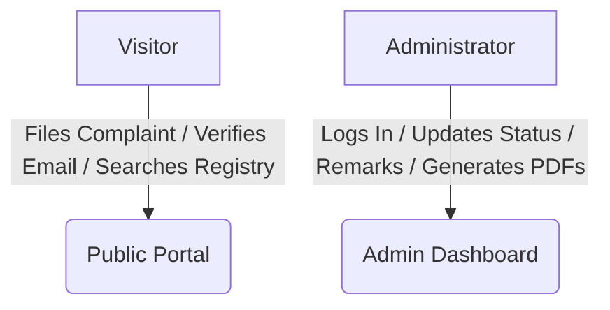
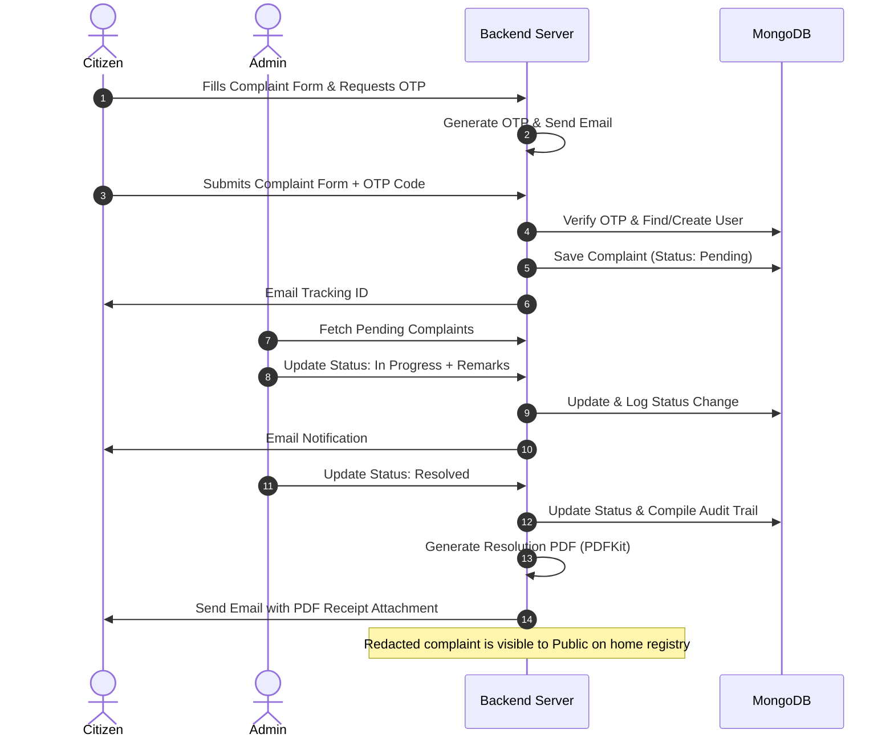
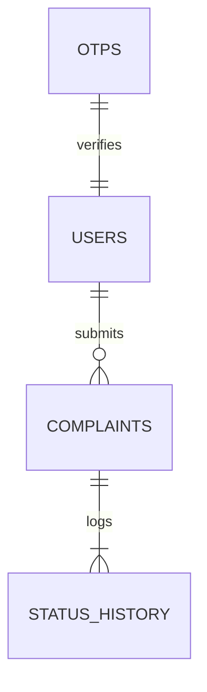

# Smart Digital Complaint Management and Public Transparency System
## Software Design Document & Implementation Blueprint (Updated)

---

### 1. Project Overview

#### 1.1 System Explanation
The **Smart Digital Complaint Management and Public Transparency System** is a web-based portal designed to bridge the communication gap between citizens and local government/administration. It provides a structured channel for logging complaints related to public issues (such as road damage, sanitation, utilities, or administrative misconduct), tracking these complaints in real-time, and promoting public trust through a public transparency portal where all filed cases are published.

#### 1.2 Primary Objectives
* **Empower Citizens:** Streamline the logging and tracking of community issues without account wall requirements.
* **Optimize Admin Workflows:** Provide administrative dashboards to categorize, assign, update, and resolve complaints.
* **Enforce Transparency:** Publicly showcase all filed complaints and metrics, demonstrating administrative responsiveness.
* **Ensure Accountability:** Maintain an immutable record (audit trail) of status history and changes for every complaint.

#### 1.3 Scope
* **In-Scope:** Citizen email OTP verification on submission, multi-image complaint filing, location-based mapping/tracking, automated email alerts, PDF receipt generation, admin control panel, and public search/analytics portal.
* **Out-of-Scope:** Advanced route optimization for administrative inspections, physical dispatch logistics, payments/fines, and third-party municipal software integrations.

---

### 2. Functional Requirements

#### 2.1 Citizen Module (On-the-fly Verification)
* **Form-based Submission:** Citizens file complaints directly from the homepage by entering Name, Email, Phone, Location, Subject, Description, Category, and Supporting Images.
* **OTP Verification:** Transient, email-based OTP sent on submission to verify identity before a complaint is registered.
* **Tracking Dashboard:** Status overview (Pending, In Progress, Resolved, Rejected) with timeline records accessed via tracking IDs.
* **Download Receipt:** Export of administrative resolution summaries as PDF documents directly from the tracking page.

#### 2.2 Administrator Module
* **Dashboard Analytics:** Visual summary of unresolved, pending, and resolved issues.
* **Complaint Management:** Status updating, updating of internal and external remarks, and assignee updates.
* **Public Publication Toggle:** Option to make a resolved complaint visible on the public portal.
* **Notification Dispatch:** Triggers automated emails on status updates.

#### 2.3 Public Transparency Module
* **Public Analytics Page:** View overall administrative resolution rates and category statistics.
* **Complaint Registry Search:** Search all filed complaints by Tracking ID, category, or location (with Citizen PII redacted).

---

### 3. Non-Functional Requirements

| Metric | Target Specification |
| :--- | :--- |
| **Security** | JWT auth via HTTPOnly cookies (Admins); Transient OTP verification; Zod validations; rate-limiting. |
| **Performance** | Page loading < 2.0s; database query times < 150ms via indexing. |
| **Reliability** | 99.9% application uptime; transactional status logging. |
| **Design Aesthetics**| Solid color system strictly according to color palette (No Gradients). |
| **Usability** | Fully responsive Bootstrap layout; WCAG accessibility compatibility. |

---

### 4. User Roles & Actions



#### 4.1 Citizen / Visitor
* File complaints, upload up to 3 images, enter location, and choose categories.
* Request email OTP and verify identity to submit the complaint.
* View status log timeline of filed complaints using the Tracking ID.
* Download system-generated resolution receipts (PDFs).

#### 4.2 Administrator
* Log in, log out.
* View global KPIs (e.g., total pending, average resolution times).
* Filter and search complaints by category, status, and location.
* Update complaint status with mandatory public remarks.
* Toggle "Publish to Transparency Portal" status.

---

### 5. Complete User Flow



1. **OTP Request:** A Citizen fills out the complaint form and requests an OTP code sent to their email.
2. **Submission:** Citizen enters the 6-digit OTP code and submits the form. Backend verifies the OTP, creates/finds the User account, registers the complaint as `Pending`, and emails the Citizen a Tracking ID.
3. **Execution:** Admin updates status to `In Progress` with remarks, notifying the citizen.
4. **Resolution:** Admin marks it `Resolved` with final remarks.
5. **Closure:** PDFKit compiles a PDF document. System emails it to the Citizen. The complaint (excluding name/email/phone) appears on the Public Transparency Portal searchable by location and type.

---

### 6. Feature Breakdown

#### 6.1 On-the-fly Verification
* **Purpose:** Ensure email authenticity before complaint submission.
* **Dependencies:** `nodemailer`, `otp-generator`.
* **APIs Required:**
  * `POST /api/complaints/request-otp` (Send verification OTP)
  * `POST /api/complaints` (Multipart form-data: verifies OTP, creates user, files complaint)

#### 6.2 Complaint Tracking & Dashboard
* **Purpose:** Monitor complaint status and access logs.
* **APIs Required:**
  * `GET /api/complaints/track/:trackingId` (Timeline details)
  * `GET /api/complaints/download-receipt/:trackingId` (Download resolution PDF publicly)

#### 6.3 Admin Dashboard & Control
* **Purpose:** Control panel for administrators.
* **APIs Required:**
  * `POST /api/auth/login` (Admin credential verification)
  * `GET /api/admin/complaints` (Paginated list of all complaints)
  * `PATCH /api/admin/complaints/:id/status` (Update state)
  * `GET /api/admin/stats` (KPI analytics summary)

#### 6.4 Public Transparency Registry
* **Purpose:** Publicly display all complaints with redacted citizen details.
* **APIs Required:**
  * `GET /api/public/complaints` (Redacted registry searchable by category & location)
  * `GET /api/public/stats` (Breakdown of status totals)

---

### 7. Database Design



#### 7.1 Users
* **Fields:**
  * `_id` (ObjectId)
  * `name` (String, Required)
  * `email` (String, Required, Unique, Indexed)
  * `password` (String, Required, Hashed)
  * `phone` (String, Required)
  * `role` (String, Enum: `['citizen', 'admin']`, Default: `citizen`)
  * `isVerified` (Boolean, Default: `false`)
  * `createdAt` / `updatedAt` (Timestamps)

#### 7.2 OTPs
* **Fields:**
  * `_id` (ObjectId)
  * `email` (String, Required)
  * `otp` (String, Required)
  * `expiresAt` (Date, TTL Indexed, 5 minutes expire limit)

#### 7.3 Complaints
* **Fields:**
  * `_id` (ObjectId)
  * `trackingId` (String, Required, Unique, Indexed)
  * `citizenId` (ObjectId, Ref: `Users`, Required, Indexed)
  * `title` (String, Required)
  * `description` (String, Required)
  * `category` (String, Required, Indexed)
  * `location` (String, Required, Indexed)
  * `images` (Array of Strings / Filepaths)
  * `status` (String, Enum: `['Pending', 'In Progress', 'Resolved', 'Rejected']`, Default: `Pending`, Indexed)
  * `isPublic` (Boolean, Default: `false`, Indexed)
  * `statusHistory` (Array of Embedded Sub-documents)
  * `createdAt` / `updatedAt` (Timestamps)

---

### 8. REST API Design

#### 8.1 Public / Verification Endpoints
* **`POST /api/complaints/request-otp`**
  * *Request Body:* `{ "email": "john@email.com" }`
  * *Response Body:* `{ "success": true, "message": "Verification OTP sent." }`
  * *Auth:* Public.

* **`POST /api/complaints`**
  * *Request Body:* Multipart form-data (`name`, `email`, `phone`, `otp`, `title`, `description`, `category`, `location`, `images`)
  * *Response Body:* `{ "success": true, "complaint": { "trackingId": "COMP-XXXX-X" } }`
  * *Auth:* Public.

* **`GET /api/public/complaints`**
  * *Request Params:* `category`, `location`, `status`, `page`, `limit`
  * *Response Body:* `{ "success": true, "complaints": [...] }` (Citizen info strictly excluded)
  * *Auth:* Public.

#### 8.2 Admin Endpoints
* **`POST /api/auth/login`**
  * *Request Body:* `{ "email": "admin@email.com", "password": "password123" }`
  * *Response Body:* `{ "success": true, "token": "JWT_TOKEN", "user": { "role": "admin" } }`
  * *Auth:* Public.

---

### 9. Frontend Component Structure

```
src/
├── assets/                 # SVGs, static files
├── components/             
│   └── shared/
│       └── Navbar.jsx      # Navigation header (handles Admin Portal redirect)
├── contexts/
│   └── AuthContext.jsx     # Handles Admin session auth state
├── layouts/
│   ├── MainLayout.jsx      # Header/Footer template (Solid navbar styling)
│   └── AdminLayout.jsx     # Sidebar template for administrators
├── pages/
│   ├── admin/
│   │   ├── AdminDashboard.jsx
│   │   └── ComplaintDetail.jsx
│   ├── citizen/
│   │   └── Login.jsx       # Adapted purely for Admin Login
│   └── public/
│       ├── Home.jsx        # Landing page with KPIs, search repository, & submission form
│       └── Tracker.jsx     # Tracking detail visual timeline
└── services/
    └── api.js              # Axios configuration
```
