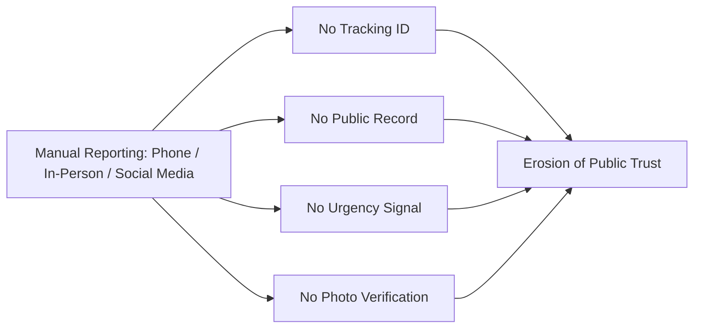
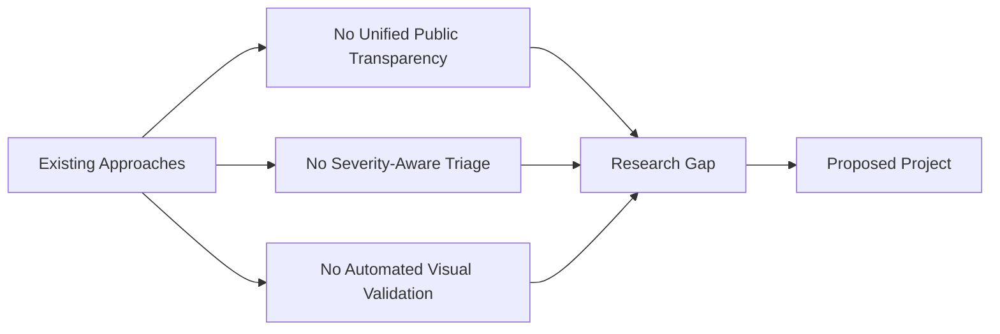
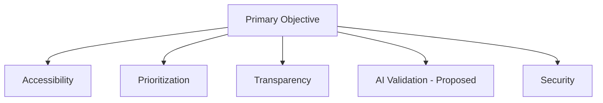
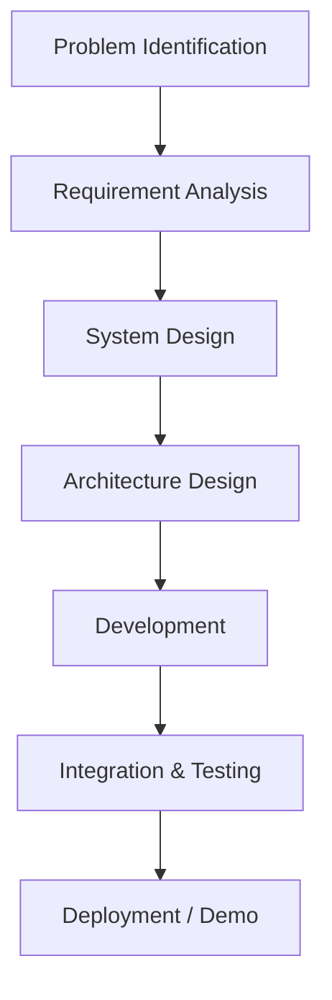
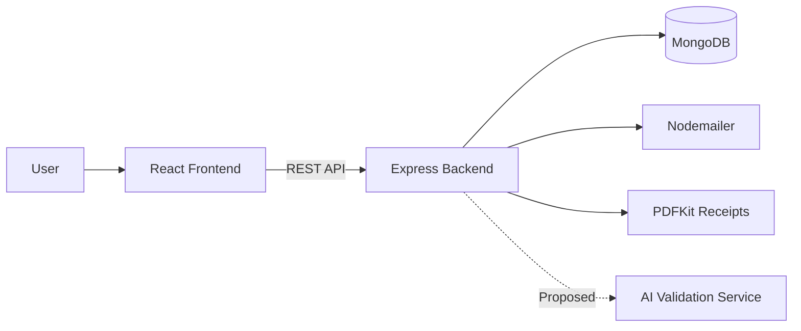
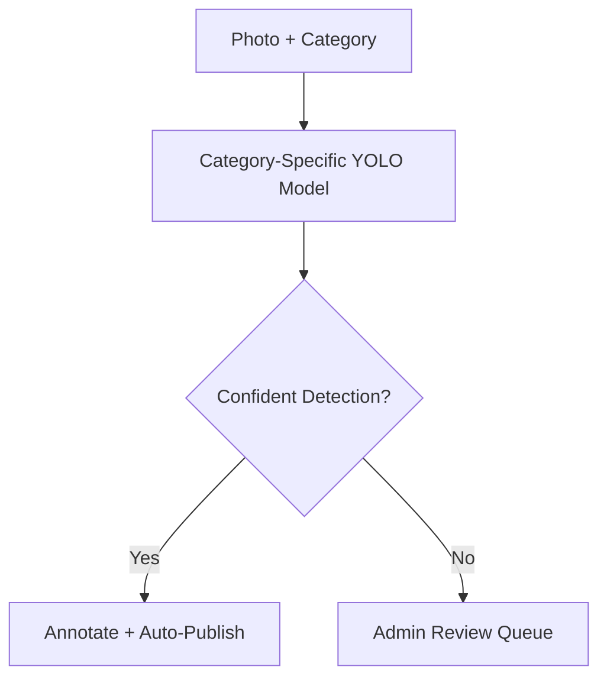
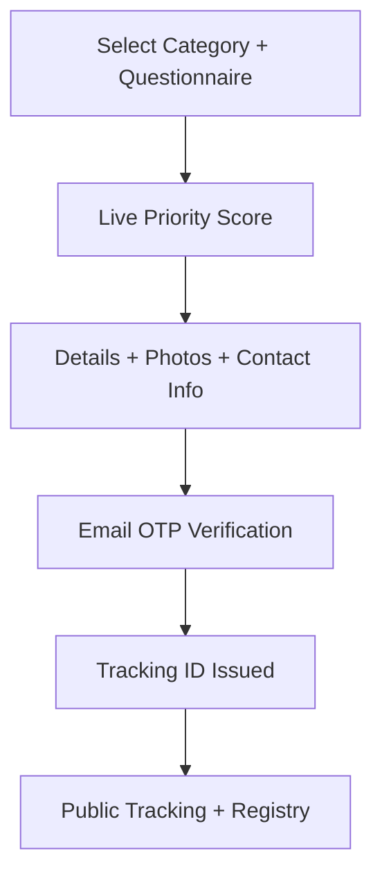
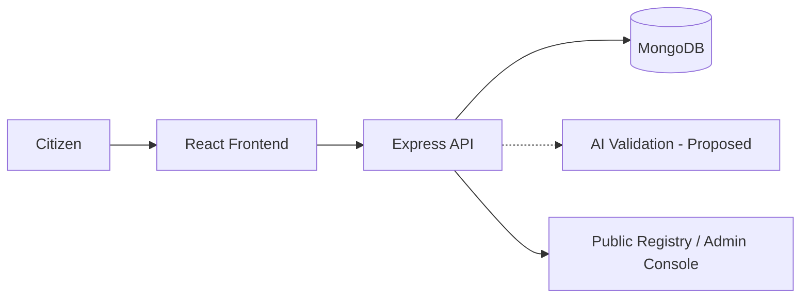

# Project Presentation Content (10-Slide Version)

Condensed from `project_description.md` for a 10-slide PPT. One slide = one heading below.

---

## Slide 1 — Title

**Smart Digital Complaint Management and Public Transparency System**
*Account-less civic issue reporting, public audit trails, and AI-assisted photo validation*

* Web portal for citizens to report public infrastructure issues (potholes, garbage, water leakage, streetlights, and 6 more categories)
* No account required — email OTP verification only
* Public registry + admin console + proposed AI validation layer

---

## Slide 2 — Problem Identification

* Civic issues are reported today via phone hotlines, in-person visits, or informal social posts
* No tracking ID, no public record, no category-specific urgency, no photo verification
* Result: lost/duplicate complaints, inconsistent triage, no public accountability

**Problem Statement:** Civic issue reporting is fragmented, untracked, and invisible to the public — no single transparent system captures what was reported, how urgent it is, and what happened next.

---

## Slide 3 — Literature Survey & Research Gap

| Prior Approach | Strength | Limitation |
|---|---|---|
| Phone hotlines / 311-style *(representative)* | Centralized entry point | No photo evidence, no public tracking |
| Crowdsourced issue maps *(e.g. FixMyStreet-style)* | Public visibility | No identity check, no urgency scoring |
| Generic helpdesk ticketing | Mature status workflow | Not citizen-facing / not transparent |
| CV-based defect detection *(suggested research area)* | Automated visual check | Needs category-specific training data |

---

## Slide 4 — Objectives

**Primary Objective:** Design a transparent, account-less civic complaint platform with severity-aware triage and AI-assisted photo validation.

* Accessibility — OTP verification, no account
* Structured categorization — fixed 10-category taxonomy
* Intelligent prioritization — weighted questionnaire score
* Automated visual validation *(proposed)* — per-category AI detection
* Transparency & auditability — public registry + status history
* Security — JWT-protected admin actions

---

## Slide 5 — Scope

* **In Scope:** OTP submission, 10-category questionnaire, priority scoring, public registry, admin status workflow, PDF receipts
* **Out of Scope:** native apps, chat, payments, multi-language
* **Future Scope:** production AI validation service, auto-routing, analytics

---

## Slide 6 — Methodology

---

## Slide 7 — System Architecture

* **Frontend:** React (Vite) — citizen wizard, public registry, admin console
* **Backend:** Express.js / Node.js — REST API, OTP, status workflow
* **Database:** MongoDB — Users, Complaints, OTPs (TTL)
* **Services:** Nodemailer (email), PDFKit (receipts)

---

## Slide 8 — Proposed AI Validation Layer

* One YOLO-based object-detection model per category (e.g. `pothole_road_damage_model.pt`)
* Detects the issue, draws a bounding box, returns confidence + annotated image
* Low-confidence detections are routed to an admin review queue instead of auto-publishing
* **Status:** proposed architecture, not yet implemented in the current codebase

---

## Slide 9 — User Workflow

---

## Slide 10 — Conclusion & Final Architecture

* Replaces fragmented, untracked civic reporting with one transparent, OTP-verified, auditable platform
* Weighted questionnaire delivers consistent, explainable priority triage
* Proposed AI layer adds automated visual validation as the system's next extension

